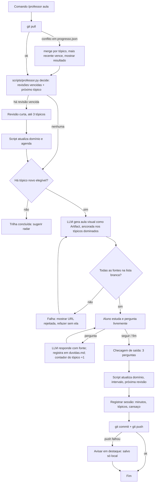

# Spec — Professor IA (tutor pessoal de IA, visual e interativo)

> **Status: RASCUNHO PARA APROVAÇÃO.** Nenhum código é escrito antes de o dono do projeto
> aprovar este desenho (regra 2 da metodologia). Diálogos de exemplo, diagrama e staging
> abaixo. Edge cases estão como ramos explícitos no diagrama.
>
> Data: 30/09/2026 · Fase: pessoal (1 aluno). A fase comercial está na seção 10, só
> como direção, sem compromisso de desenho.

---

## 1. A dor (nas palavras do dono)

- "Aprender sobre IA e seus avanços."
- "Professor eficiente que ensine usando recursos visuais e exemplos."
- "Seguir uma matéria só lendo é cansativo; preciso de visual, mas também de poder fazer
  perguntas à medida que vou aprendendo."

Restrições declaradas na descoberta:

- Estudo acontece **dentro do Claude Code** (PC ou celular via Claude Code web).
- Progresso e tudo mais **salvo na nuvem**; estudar preso a um único aparelho quebra o hábito.
- Fontes em inglês servem, quanto mais atuais melhor, mas **só fontes legítimas**: nada de
  especulação, rumor ou "ideia não oficial".
- Tudo transmitido **em português**, com o termo em inglês seguido da tradução entre
  parênteses. Ex.: "isso serve pra fazer uma *Home Page* (Página Principal)".
- Nível atual **desconhecido**: precisa de diagnóstico antes de começar.

## 2. A dor real (o que vamos endereçar, não o pedido literal)

O pedido literal é "um curso com visual". A dor real é **não ter um professor que se lembre
de onde você está**. Leitura cansa porque é passiva e não sabe o que você já domina. A
solução é um sistema que:

1. **Lembra** o que você domina, o que está fraco e quando revisar (estado persistente).
2. **Explica** cada tópico novo com visual e exemplo **ancorado no que você já sabe**.
3. **Aceita pergunta no meio da aula** sem perder o fio, e usa a pergunta como sinal de
   dificuldade.
4. **Acompanha os avanços de IA** a partir de fontes oficiais e os encaixa na sua trilha,
   porque IA é alvo em movimento e um curso estático envelhece em 90 dias.

## 3. O que já existe e o que NÃO vamos reconstruir (regra 1)

| Peça | Já resolvido por | Nossa decisão |
|---|---|---|
| Aula visual gerada a partir de fontes | NotebookLM (vídeo, mapa mental, flashcards) | Não reconstruir. Nossa aula visual é uma página interativa gerada na sessão (Artifact), porque precisa nascer **do estado do aluno**, o que o NotebookLM não tem. |
| Tutor socrático que guia em vez de responder | Claude Learning Mode, Gemini Guided Learning, ChatGPT Study Mode | Reaproveitar o estilo. O diferencial é o estado persistente entre sessões e aparelhos. |
| Revisão espaçada | Anki + FSRS (algoritmo aberto) | Não reconstruir o algoritmo. Implementar uma versão mínima e determinística (SM-2 simplificado) em script, com testes. Se a fase comercial vier, trocar por FSRS. |
| Busca de avanços | Motores de busca, feeds oficiais | Usar busca com **lista branca de domínios oficiais** (seção 7). |

O que nenhuma ferramenta pronta junta: trilha persistente + aula visual gerada do estado +
pergunta em contexto que vira dado + radar de avanços mapeado à trilha. Isso é o projeto.

## 4. Princípios de desenho (herdados da metodologia)

- **LLM não decide lógica de negócio (regra 7).** O LLM explica, desenha, redige, grada
  resposta aberta e traduz. **Quem decide** o que ensinar agora, quando revisar, se um tópico
  está dominado e o que entra no radar é **código lendo arquivos de estado**.
- **Estado é arquivo versionado em Git.** O repositório no GitHub é a nuvem. Sessão começa
  com `git pull`, termina com `git commit` + `git push`. Isso dá multi-aparelho, histórico e
  reversão de graça (regra 3).
- **Fonte legítima é regra mecânica, não promessa.** Existe um arquivo de lista branca; o
  radar só pesquisa nesses domínios; toda afirmação de aula cita uma fonte da lista. Fonte
  fora da lista é rejeitada por código.
- **Português com termo original.** Convenção obrigatória na primeira ocorrência de cada
  termo em uma aula: `*Termo em inglês* (tradução)`. Um `glossario.md` acumula os termos.
- **Métrica do depois definida antes (princípio 10).** Ver seção 9.

## 5. Estrutura do repositório (proposta: repositório próprio `professor-ia`)

Este repositório (`metodologia-claude`) guarda só a spec. O projeto nasce em repositório
próprio, privado, pra manter a metodologia pública e o progresso pessoal privado.

```
professor-ia/
├── CLAUDE.md                     # como o Claude conduz uma sessão (aponta pra skill)
├── .claude/skills/professor/     # a skill: comandos "aula", "revisar", "pergunta", "radar", "diagnostico"
│   └── SKILL.md
├── curriculo/
│   ├── trilha.md                 # módulos e tópicos, com pré-requisitos (fonte da verdade do "o quê")
│   └── banco_diagnostico.json    # perguntas de nivelamento versionadas (não geradas ao vivo)
├── estado/
│   ├── progresso.json            # domínio por tópico + agenda de revisão (fonte da verdade do "onde estou")
│   ├── duvidas.md                # toda pergunta feita, com data, tópico e resposta curta
│   └── glossario.md              # termo em inglês → tradução, acumulado
├── aulas/
│   └── AAAA-MM-DD_topico.html    # cada aula visual gerada, versionada (abre no celular via Artifact)
├── radar/
│   ├── fontes_permitidas.md      # lista branca de domínios oficiais
│   └── AAAA-MM-DD.md             # resumo semanal de avanços, mapeado a tópicos da trilha
├── scripts/
│   ├── professor.py              # decisões determinísticas: próximo tópico, agenda, atualização de domínio
│   └── test_professor.py         # regressão do scheduler e do validador de fontes
└── docs/
    └── spec_professor_ia.md      # esta spec (copiada daqui)
```

### 5.1 `estado/progresso.json` (esquema)

```json
{
  "aluno": "rx",
  "versao_esquema": 1,
  "atualizado_em": "2026-09-30",
  "topicos": {
    "m2.atencao": {
      "dominio": 2,
      "escala": "0=nunca visto, 1=visto, 2=entende com ajuda, 3=explica sozinho, 4=aplica",
      "ultima_revisao": "2026-09-28",
      "proxima_revisao": "2026-10-02",
      "intervalo_dias": 4,
      "acertos_seguidos": 1,
      "perguntas_feitas": 3,
      "aulas": ["aulas/2026-09-25_atencao.html"]
    }
  },
  "sessoes": [
    {"data": "2026-09-28", "minutos": 32, "topicos": ["m2.atencao"], "cansaco": 2}
  ]
}
```

### 5.2 Regras determinísticas do `scripts/professor.py`

- **Próxima ação da sessão:** (1) revisões vencidas (`proxima_revisao <= hoje`), no máximo 3;
  (2) depois, o primeiro tópico da trilha cujo pré-requisito esteja com `dominio >= 3` e o
  próprio `dominio <= 1`; (3) se nada, "trilha concluída, ir pro radar".
- **Atualizar domínio após checagem de 3 perguntas:** 3/3 sobe 1 nível (máx. 4) e dobra o
  intervalo; 2/3 mantém nível e intervalo; 0 ou 1 desce 1 nível (mín. 1) e volta o intervalo
  pra 1 dia.
- **Pergunta como sinal:** cada pergunta na aula incrementa `perguntas_feitas`. Ao fechar a
  aula, `perguntas_feitas >= 3` no mesmo tópico **impede subir de nível** naquela sessão,
  mesmo com 3/3 na checagem (a pergunta revela dúvida que a checagem não pegou).
- **Validador de fontes:** toda URL citada numa aula ou radar precisa casar com
  `radar/fontes_permitidas.md`. URL fora da lista quebra o comando e mostra a URL rejeitada.
- **Nada disso é decidido pelo LLM.** O LLM recebe o resultado do script ("hoje: revisar
  m2.atencao, depois ensinar m3.tokens") e obedece.

## 6. Diálogos de exemplo (como uma sessão real se parece)

### 6.1 Primeira sessão: diagnóstico

```
Você:      /professor diagnostico

Professor: Antes de ensinar, preciso saber onde você está. São 18 perguntas rápidas,
           3 por área, umas 12 minutos. Não tem nota: o objetivo é eu não te ensinar
           o que você já sabe e não pular o que você precisa.
           Responda com o que souber; "não sei" é resposta válida e útil.

           Área 1 de 6: Fundamentos.
           1) Em uma frase: qual a diferença entre *Machine Learning* (Aprendizado de
              Máquina) e programação tradicional?

Você:      No ML o programa aprende com exemplos em vez de eu escrever a regra.

Professor: Certo. (...)
           [ao fim das 18]
           Resultado do nivelamento (salvo em estado/progresso.json):

           Fundamentos ........... 3 (explica sozinho)
           LLMs na prática ....... 2 (entende com ajuda)
           Prompting ............. 3
           Embeddings e RAG ...... 1 (já viu)
           Agentes e ferramentas . 2
           Treinamento/ajuste .... 0 (nunca visto)

           Recomendação: começar pelo módulo 3 (como um LLM funciona na prática:
           *tokens* (unidades de texto), *context window* (janela de contexto),
           custo). Fundamentos e prompting entram só em revisão.
           Aprovar esse ponto de partida? Posso mudar se você preferir outro.
```

### 6.2 Sessão normal: revisão, aula visual, pergunta no meio

```
Você:      /professor aula

Professor: [git pull feito; scripts/professor.py decidiu: 1 revisão vencida + 1 tópico novo]

           Antes da aula nova, uma revisão de 2 minutos: *attention* (atenção),
           visto há 4 dias.
           Sem olhar nada: por que o mecanismo de atenção permite que a palavra
           "banco" seja entendida diferente em "banco de praça" e "banco do Brasil"?

Você:      Porque ele olha as outras palavras da frase e dá peso maior pras que
           importam pro sentido.

Professor: Exato. Revisão fechada: 1/1. Próxima revisão em 8 dias.

           Aula de hoje: *tokens* (unidades de texto) e *context window* (janela de
           contexto). Abri a aula visual aqui (link do Artifact, abre no celular):
           - Um tokenizador ao vivo: você digita uma frase e vê como ela é fatiada.
           - Uma régua mostrando a janela de contexto enchendo conforme a conversa cresce.
           - Exemplo ancorado no que você já usa: por que o seu agente no n8n "esquece"
             o começo de conversas longas.
           Fonte: documentação oficial da Anthropic sobre tokens e contexto (link).

Você:      Pera, então o custo é por token e não por palavra? Em português sai mais
           caro?

Professor: Boa pergunta, e sim. [registra em estado/duvidas.md: tópico m3.tokens]
           Custo é por *token*. Palavras em português costumam virar mais tokens que
           em inglês, porque os tokenizadores foram treinados com mais texto em inglês.
           Na aula visual, digite "configuração" e "configuration" no tokenizador e
           compare a contagem. Fonte: página oficial de preços e a doc de tokenização.
           Quer seguir pra janela de contexto ou explorar isso mais um pouco?

Você:      Seguir.

Professor: (...)
           Checagem de saída, 3 perguntas curtas.
           [2/3] Você acertou tokens e custo, errou o que acontece quando a janela
           estoura. Domínio de m3.tokens: 1 → 2 (entende com ajuda).
           Próxima revisão: em 2 dias.
           Salvo e enviado pro GitHub (commit "sessao 2026-09-30: m3.tokens 2/3").
           Sessão: 28 minutos. De 1 a 5, quanto cansou?

Você:      2

Professor: Registrado. Até a próxima.
```

### 6.3 Radar semanal de avanços

```
Você:      /professor radar

Professor: Buscando os últimos 7 dias só nas fontes permitidas (Anthropic, OpenAI,
           Google DeepMind, arXiv, Hugging Face, documentações oficiais).
           3 itens relevantes pra sua trilha; 5 descartados por serem fora da lista
           branca ou opinião.

           1) Anthropic publicou nova doc sobre *prompt caching* (cache de prompt).
              Conecta com: m3.tokens (você está em 2/4). Sugestão: mini-aula de 10 min
              na próxima sessão. Fonte: (link oficial).
           2) arXiv: artigo de avaliação de agentes com ferramentas.
              Conecta com: m6.agentes (domínio 2). Guardado na fila; entra quando m6
              chegar a 3.
           3) Hugging Face: modelo aberto novo para embeddings multilíngues.
              Conecta com: m5.embeddings (domínio 1). Fila.

           Salvo em radar/2026-09-30.md. Quer a mini-aula do item 1 agora?
```

### 6.4 Edge cases que viram ramo explícito

- **Sem rede ou push falhou:** a sessão continua; ao final, avisar em destaque "progresso
  salvo só local, não subiu", e tentar de novo na próxima sessão antes de qualquer coisa.
- **Conflito de estado entre aparelhos** (estudou no celular sem push, depois no PC):
  `git pull` falha por conflito em `progresso.json`; o script faz merge por tópico
  pegando o registro mais recente de cada um, e mostra o que juntou. Nunca descarta em
  silêncio.
- **Fonte fora da lista branca citada:** comando falha mostrando a URL; o LLM refaz a aula
  sem a fonte ou pede inclusão explícita da fonte na lista (decisão do dono, em commit).
- **Aluno pergunta algo fora da trilha:** responde curto, registra em `duvidas.md` com
  tópico "fora_trilha", e sugere onde isso entraria na trilha. Não desvia a aula.
- **Muito tempo sem estudar (> 14 dias):** o script rebaixa nada automaticamente; propõe
  uma sessão só de revisão antes de tópico novo.

## 7. Fontes permitidas (lista branca inicial, editável por commit)

Primárias e oficiais apenas. Notícia, opinião, rede social e vídeo de comentário ficam de
fora por regra, mesmo que citem fonte oficial.

- Anthropic: `anthropic.com`, `docs.claude.com`
- OpenAI: `openai.com` (blog, research, docs)
- Google: `deepmind.google`, `ai.google.dev`, `blog.google` (só seção de IA)
- Meta: `ai.meta.com`
- Mistral: `mistral.ai`
- Artigos científicos: `arxiv.org` (marcar como "pré-publicação, não revisado por pares")
- Hugging Face: `huggingface.co` (blog e docs; cartão de modelo oficial)
- Ferramentas: `pytorch.org`, `docs.n8n.io`, `supabase.com/docs`
- Ensino: `deeplearning.ai`, cursos de universidades em domínio `.edu`

Critério pra incluir uma fonte nova: ser o autor da coisa (quem fez o modelo, a ferramenta
ou o artigo). Critério pra recusar: ser alguém falando sobre a coisa.

## 8. Diagrama do fluxo de uma sessão



## 9. Métrica de sucesso (definida ANTES, verificada DEPOIS)

Todas saem de `estado/progresso.json`, sem sistema extra.

| Métrica | Como medir | Meta em 30 dias |
|---|---|---|
| Frequência | sessões registradas por semana | 3 ou mais |
| Retenção | acertos em revisão vencida / total de revisões | 70% ou mais |
| Avanço | tópicos com domínio >= 3 | 8 ou mais |
| Cansaço | média da nota 1 a 5 dada ao fim da sessão | 2,5 ou menos |
| Multi-aparelho | sessões feitas em pelo menos 2 aparelhos no mês | sim |

Se em 30 dias a frequência ficar abaixo de 2 por semana, o problema é de hábito, não de
ferramenta, e a próxima iteração ataca isso (lembrete, sessão mais curta), não mais recurso.

## 10. Staging: desenho do ensaio isolado

**Blast radius:** baixo. Não há usuário externo nem produção compartilhada. O que pode
quebrar: o arquivo de progresso real (perder histórico de estudo) e a confiança na regra de
fontes (aula com fonte ilegítima passando).

**Forma de ensaio escolhida:** perfil de teste isolado + testes automatizados do script.

1. **Perfil de teste.** A skill aceita `--perfil teste`, que lê e grava em `estado-teste/`
   em vez de `estado/`. Todo desenvolvimento da skill roda nesse perfil. Registros de teste
   levam prefixo `TESTE_` no campo `aluno`. Fim de sessão de desenvolvimento apaga
   `estado-teste/` (regra 6).
2. **Regressão do script.** `scripts/test_professor.py` cobre: escolha do próximo tópico
   com pré-requisito, subida e descida de domínio, bloqueio por perguntas, merge de
   conflito, validador de fontes com URL boa, ruim e disfarçada (subdomínio falso). Tem
   que passar 3 vezes seguidas antes de qualquer alteração ir pro perfil real.
3. **Paridade.** Antes de promover, o teste roda com uma **cópia do `progresso.json` real**
   (estado de dados de produção, lição de 26/08), não com um JSON magro inventado.
4. **Canário.** Primeira sessão real com a versão nova é uma revisão curta (não uma aula
   nova), com o dono olhando o diff do `progresso.json` antes do push.
5. **Reversibilidade.** Git. Todo commit de sessão é atômico e nomeado
   (`sessao AAAA-MM-DD: topico X/3`). Reverter é `git revert` de um commit.
6. **Silêncio também é falha (regra 8).** Onda 3 cria uma rotina semanal que checa a data
   do último commit de sessão; sem commit em 7 dias, manda um lembrete. O lembrete vive
   fora do repositório (rotina agendada), não dentro do sistema que pode estar parado.

## 11. Plano de Ação em ondas (critério de aceite por onda)

### Onda 1: fundação e diagnóstico
- Criar repositório privado `professor-ia` com a estrutura da seção 5.
- `curriculo/trilha.md` v1 (seção 12) e `banco_diagnostico.json` com 18 perguntas.
- `scripts/professor.py` com scheduler, validador de fontes e merge; `test_professor.py`
  verde 3x.
- Skill `professor` com comandos `diagnostico` e `aula` (sem radar ainda).
- **Aceite:** diagnóstico rodado de verdade pelo dono; `progresso.json` gerado; uma
  sessão feita no PC e a seguinte no celular, com o estado batendo nos dois.

### Onda 2: aulas visuais, perguntas, revisão
- Aula como Artifact interativo (diagramas, exemplo executável, ancoragem no dominado).
- Registro de perguntas em `duvidas.md` e regra de bloqueio por perguntas.
- Glossário automático com a convenção `*termo* (tradução)`.
- **Aceite:** 3 aulas reais concluídas; pelo menos 1 revisão vencida cobrada e registrada;
  o dono confirma que a aula abre e é legível no celular.

### Onda 3: radar e vigilância
- Comando `radar` com busca restrita à lista branca e mapeamento a tópicos.
- Rotina semanal de lembrete por silêncio (> 7 dias sem commit).
- **Aceite:** um radar real gerado só com fontes da lista; um item do radar virou
  mini-aula; lembrete disparou num teste controlado.

### Onda 4 (futuro, fora deste escopo): comercial
- Estado migra de Git pra Supabase (multiusuário, RLS por aluno).
- Interface web ou WhatsApp para quem não usa Claude Code.
- Custo de LLM por aluno medido desde o dia 1 (seção 5 do guia de boas práticas).

## 12. Trilha v1 (módulos; tópicos detalhados nascem na onda 1)

| Módulo | Tema | Pré-requisito |
|---|---|---|
| M1 | Fundamentos: IA, *Machine Learning* (Aprendizado de Máquina), *Deep Learning* (Aprendizado Profundo), treino vs inferência | nenhum |
| M2 | Redes neurais e o *Transformer*: *embeddings* (vetores de significado), *attention* (atenção) | M1 |
| M3 | LLM na prática: *tokens*, *context window* (janela de contexto), *temperature*, custo | M2 |
| M4 | *Prompting* e engenharia de contexto: *system prompt*, exemplos, *structured output* (saída estruturada) | M3 |
| M5 | Busca semântica e *RAG* (geração com recuperação) | M2, M4 |
| M6 | Agentes, *tools* (ferramentas), *MCP*, o que é decisão de código vs de modelo | M4 |
| M7 | Avaliação, alucinação, segurança, *guardrails* (trilhos de proteção) | M6 |
| M8 | Como modelos são treinados: pré-treino, *fine-tuning* (ajuste fino), *RLHF* | M3 |
| M9 | Multimodal: imagem, áudio, voz | M3 |
| M10 | Ecossistema e avanços (alimentado pelo radar, sem fim) | M7 |

## 13. Estimativa honesta de esforço

| Onda | Horas |
|---|---|
| 1 | 8 a 12 |
| 2 | 6 a 10 |
| 3 | 4 a 6 |
| Total fase pessoal | 18 a 28 |

Sem custo de API: roda na assinatura do Claude Code. Custo real é o tempo do dono nas
sessões de estudo, que é o objetivo.

## 14. Decisões que o dono precisa aprovar

1. Repositório próprio e privado `professor-ia` (em vez de pasta neste repo público).
2. Git como nuvem do estado (em vez de Supabase nesta fase).
3. Lista branca inicial da seção 7.
4. Escala de domínio 0 a 4 e regras de subida/descida da seção 5.2.
5. Metas de 30 dias da seção 9.

Aprovado, a onda 1 começa pela criação do repositório e do script com testes, nessa ordem.
