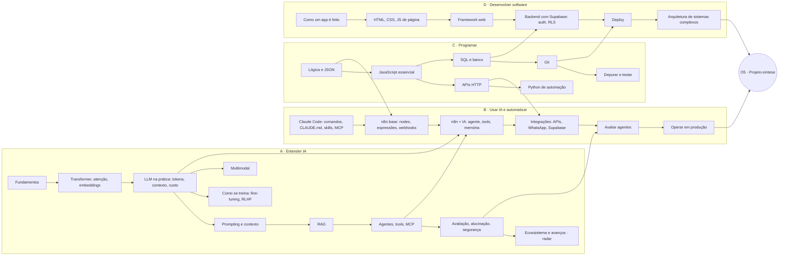
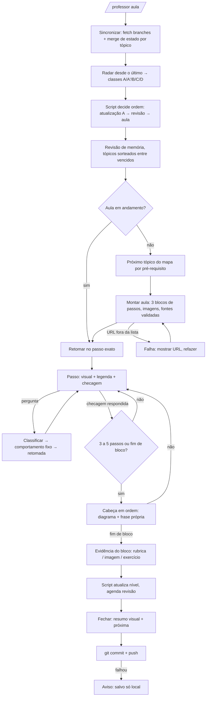

# Spec — Professor IA (tutor pessoal, visual, um passo por vez)

> **Status: v3, RASCUNHO PARA APROVAÇÃO.** Nenhum código antes do ok do dono (regra 2).
> Data: 30/09/2026 · Fase: pessoal (1 aluno). Fase comercial: seção 16, só direção.
>
> **v3.2:** termômetro de ritmo e previsão em horas (seção 9.1) e decisão 10. Tempo volta
> como MEDIDA (entrada da previsão), nunca como meta.
>
> **v3.1:** arquitetura motor/matéria (seção 7.1) e decisão 9.
>
> **v3 em relação à v2:** objetivos do dono viram o ponto de partida (desenho reverso);
> mapa de 4 trilhas + eixo transversal; cronograma por dependência e contagem, não por
> data; estrutura de ensino baseada em evidência (passo, ritmo, "cabeça em ordem");
> menos texto, mais visual, também na forma como o professor fala; um exemplo de diálogo
> só, curto, mostrando o ritmo certo.

---

## 1. A dor e as restrições (resumo)

| Dor (palavras do dono) | O que o desenho faz com ela |
|---|---|
| Aprender IA e seus avanços | trilha A + radar por regra (seção 10) |
| Professor eficiente, visual, com exemplos | passo = 1 visual + legenda + checagem (seção 5) |
| Ler cansa; quero perguntar enquanto aprendo | o fio: aula em arquivo com cursor (seção 8) |
| Não passar 3 assuntos sem checar nenhum | 1 ideia por passo; nada avança sem checagem (seção 5) |
| Resumo breve pra pôr a cabeça em ordem | "cabeça em ordem" a cada 3 a 5 passos (seção 5) |
| Entender a lógica, não só usar | bloco "lógica" sempre antes de "prática" (seção 7) |
| Imagens de apps, páginas, ícones, formatação | regra de imagens por prioridade (seção 7.2) |
| Medir conhecimento, não tempo, de 1 a 10 | escala por evidência (seção 6) |
| Ver sempre um termômetro: ritmo por assunto e horas que faltam | termômetro de ritmo (seção 9.1) |
| Fontes legítimas, atuais, em inglês; aula em português com termo + tradução | lista branca mecânica; glossário (seção 10) |
| Estudar no Claude Code, de qualquer aparelho | estado em Git; celular é teste de aceite (seção 14) |

## 2. Objetivos → evidências (desenho reverso)

O dono quer: **dominar IA, montar automações, programar, desenvolver softwares, e entender
e montar estruturas complexas usando IA (sites, apps, n8n).**

Cada objetivo vira uma **evidência final** concreta. A trilha existe pra chegar nelas.

| # | Quero conseguir... | Evidência final (o que prova) | Trilha principal |
|---|---|---|---|
| O1 | Dominar IA: explicar como funciona e julgar o que é real | Avaliar um modelo ou ferramenta nova em 1 hora e escrever parecer com fontes oficiais, sem erro de conceito | A |
| O2 | Montar automações | Automação n8n com IA em produção, com staging, regressão e alerta (a própria metodologia do dono) | B |
| O3 | Programar | Escrever e depurar um serviço próprio (JavaScript ou Python) que consome uma API e grava em banco | C |
| O4 | Desenvolver softwares | Site ou app funcional com backend, login, banco e deploy, construído com Claude Code | D |
| O5 | Montar estruturas complexas com IA | **Projeto-síntese:** um sistema que junta app + n8n + agente IA + banco, seguro e versionado. Recomendação: a versão comercial deste próprio Professor IA | A+B+C+D |

O5 é o fim da trilha. Cada trilha tem um projeto menor no meio pra não deixar a prática só
pro final.

## 3. Mapa de trilhas

Quatro trilhas e um eixo transversal. Cada tópico tem pré-requisitos; o mapa é um grafo,
não uma fila.



**Eixo transversal E · Organizar e proteger:** segredos, versionamento, staging, backup,
teste, o guia de boas práticas do próprio dono. Não é trilha separada: cada exercício de
B, C e D tem um item de E no critério de verificação ("sem segredo no arquivo", "commit
antes de mexer", "testou no staging").

Tópicos detalhados (passos e checagens) nascem na onda 1, tópico a tópico, nunca todos de
uma vez.

## 4. Cronograma: por dependência e contagem, não por data

- **Próximo tópico** = o primeiro do mapa cujos pré-requisitos estão no nível 5 ou mais e
  que ainda está abaixo de 5. Decisão do script.
- **Rotação entre trilhas:** cada sessão foca **um** tópico de **uma** trilha. Sessões se
  alternam entre trilhas quando os pré-requisitos permitem (variedade sem mistura dentro
  da aula). A revisão espaçada é onde os tópicos se misturam.
- **O que o dono vê** no começo de toda sessão: um mapa com o tópico atual destacado, os
  que abrem depois dele, e "faltam N passos pra fechar este tópico e M tópicos pra O2".
  Contagens, nunca datas.
- **Diagnóstico inicial** posiciona em cada trilha (até o nível 6). O mapa já nasce com
  os tópicos conhecidos marcados.

## 5. Estrutura de ensino (baseada em evidência)

Base: Rosenshine (passos pequenos, checar sempre, revisar sempre), Mayer (visual carrega
a ideia, texto é legenda, cortar excesso, segmentar), Dunlosky (testar a si mesmo e
espaçar são as técnicas mais fortes; explicar com as próprias palavras e perguntar "por
quê" vêm em seguida; reler e grifar são fracas).

### 5.1 O passo (unidade mínima)

```
PASSO = 1 ideia = 1 visual + legenda de até 3 linhas + 1 checagem de memória
        nada avança sem a checagem
```

- Se um tema tem três partes, são três passos com três checagens.
- A checagem é **pergunta**, nunca "leu? ok". Respostas: acertou / errou / "de outro jeito".
- "De outro jeito" gera outra explicação com outra analogia e marca o passo como difícil.

### 5.2 O ritmo de toda aula

```
abrir: mapa + TERMÔMETRO (onde estou, ritmo, horas que faltam)
   ↓
revisar (2 min, de memória, tópicos sorteados entre os vencidos)
   ↓
passo → checo → passo → checo → passo → checo
   ↓
CABEÇA EM ORDEM · 1 diagrama-resumo + você diz em 1 frase o que viu
   ↓
passo → checo → ...  → cabeça em ordem
   ↓
fechar: resumo visual da aula + TERMÔMETRO atualizado + "a próxima é X, porque hoje você viu Y"
```

"Cabeça em ordem" acontece a cada 3 a 5 passos e ao fim de cada bloco. É template.

### 5.3 Regras de forma (valem pra aula E pra fala do professor no chat)

| Regra | Origem |
|---|---|
| Visual primeiro; o texto é legenda (até 3 linhas) | Mayer, princípio multimídia |
| Sem enfeite, sem "curiosidade extra" no meio do passo | Mayer, coerência |
| Uma seta, um destaque: o que olhar na imagem | Mayer, sinalização |
| Termo em inglês + (tradução) na primeira vez; glossário acumula | restrição do dono |
| Antes do "como", o "por quê" | Dunlosky, interrogação elaborativa |
| Mensagem do professor no chat: curta, com o visual ou o link dele; nunca parágrafo | dono: "menos texto, mais visual" |

Tudo isso é **template em código**. O LLM preenche o passo; não decide quantas ideias
cabem, nem se pula a checagem, nem se pula a cabeça em ordem.

## 6. Escala de conhecimento: 1 a 10 por tópico, por evidência

| Nível | Prova | Evidência que o script exige |
|---|---|---|
| 1 | nunca visto | nenhuma |
| 2 | viu | todos os passos da aula fechados |
| 3 | reconhece | checagens do bloco prática ≥ 2/3 |
| 4 | reconhece com segurança | 3/3 e apontou na imagem |
| 5 | entende a lógica | explicação própria cobre ≥ 60% da rubrica |
| 6 | entende bem | 100% da rubrica e perguntas na sessão < 3 |
| 7 | aplica | exercício verificado pelo resultado |
| 8 | aplica sozinho | segundo exercício, sem dica |
| 9 | domina | caso novo que mistura 2+ tópicos |
| 10 | sustenta | nível 9 e 3 revisões seguidas sem falha |

Regras fixas: sobe 1 por sessão por tópico; revisão falhada derruba 1; 3 perguntas no
tópico seguram a subida naquela sessão; nunca cai por inatividade; diagnóstico posiciona
até 6; nível geral = média (não visto = 1), mostrado também por trilha; revisão começa em
2 dias, dobra no acerto, volta a 2 no erro.

## 7. Anatomia de uma aula

Três blocos, nesta ordem, cada um feito de passos:

| Bloco | Pergunta que responde | Como fecha | Níveis |
|---|---|---|---|
| **Lógica** | por que funciona | cabeça em ordem + "me explica com suas palavras" (rubrica) | 5 e 6 |
| **Prática** | como aparece na tela | checagem objetiva + "aponte na imagem" | 3 e 4 |
| **Exercício** | você consegue fazer | verificação pelo resultado, com item do eixo E | 7 e 8 |

### 7.1 Arquitetura: motor separado da matéria (reaproveitável pra qualquer assunto)

Não é um app nesta fase. É uma **skill do Claude Code** num repositório privado: instruções
+ scripts + arquivos de estado + aulas em HTML. Sem servidor, sem instalação, sem custo
além da assinatura. O app é a onda 4 (e o projeto-síntese O5).

O que **não muda** de assunto pra assunto é o **motor**. O que muda é o **pacote de
matéria**. Aprender outro assunto depois (inglês, finanças, direito) = criar uma pasta
nova em `materias/` com cinco arquivos; o motor já ensina. É também a arquitetura do
produto comercial (várias matérias, vários alunos, um motor).

```
professor-ia/
├── CLAUDE.md                        # aponta pra skill e pra matéria ativa
├── .claude/skills/professor/        # MOTOR · a skill: diagnostico, aula, curto, radar
├── motor/
│   ├── professor.py                 # escala, agenda, próximo tópico, fio, radar, merge, validador
│   ├── test_professor.py            # regressão do motor (independe da matéria)
│   └── templates/                   # passo, ritmo, cabeça em ordem, aula.html, retomada
├── materias/
│   └── ia/                          # MATÉRIA · um pacote por assunto
│       ├── objetivos.md             # O1..O5 e evidências finais
│       ├── mapa.md                  # trilhas, tópicos, pré-requisitos (seção 3)
│       ├── diagnostico.json         # banco de nivelamento
│       ├── fontes_permitidas.md     # lista branca desta matéria
│       ├── glossario.md
│       └── aulas/
│           └── A3_tokens/
│               ├── aula.json        # fio, blocos, passos (visual, legenda, checagem), rubrica, versão
│               ├── aula.html        # a página visual; qualquer navegador; Artifact quando houver
│               ├── img/             # capturas reais e reconstruções rotuladas
│               ├── exercicio.md     # tarefa + critério + item do eixo E
│               └── CHANGELOG.md     # "v2 (12/10): mudou X, fonte Y"
└── estado/
    └── ia/                          # progresso, cursor, dúvidas, estacionamento desta matéria
```

A aula é criada uma vez e versionada quando o radar trouxer mudança. Não é regenerada por
sessão. O teste de regressão do motor roda com uma matéria de mentira (`materias/_teste/`)
pra provar que o motor não depende do conteúdo de IA.

### 7.2 Regra de imagens (prioridade aplicada pelo script)

1. **Captura real** de página pública oficial, por navegador automatizado, com URL e data.
2. **Imagem publicada pela documentação oficial** (domínio na lista branca).
3. **Reconstrução em HTML fiel**, sempre rotulada "reconstrução, não captura real".

Área logada é do dono capturar. **Nenhuma imagem entra com chave, token, cookie ou dado
de cliente visível** (regra 9). Script recusa imagem fora de `aulas/*/img/`.

## 8. O fio: perguntar sem perder a aula

A aula não mora na memória do chat. Mora em `aula.json` + cursor
(`estado/sessao_atual.json`: tópico, bloco, passo atual, passos fechados, perguntas com
classe, estacionamento). Todo turno relê os dois. Sessão cai ou muda de aparelho: retoma
no passo exato.

| A pergunta é sobre... | Comportamento fixo (script decide, LLM só classifica) |
|---|---|
| o passo atual | responde completo, com fonte |
| um passo anterior desta aula | responde curto e aponta o passo |
| um passo futuro desta aula | uma frase, marca "aparece no passo N", não adianta |
| outro tópico da trilha | duas frases, vai pro estacionamento |
| fora da trilha | registra, responde curto, sugere onde entraria |

Após **qualquer** resposta, linha de retomada obrigatória:
"Voltando. Estávamos no **passo 2: por que português custa mais**."
Tangente com mais de 3 trocas: professor oferece estacionar e voltar. O script conta.

## 9. Os quatro sinais de entendimento

| Sinal | Como é capturado | Alimenta |
|---|---|---|
| Leu | passo fechado com resposta à checagem | nível 2 |
| Entendeu a lógica | explicação própria vs rubrica | 5 e 6 |
| Aprendeu | revisão espaçada, dias depois | sobe/desce; nível 10 |
| Sabe usar | exercício verificado | 7 a 9 |

Sinais auxiliares: perguntas por tópico, "de outro jeito". Desligado por padrão: passo
longo fechado em segundos dispara checagem extra (não vira nota).

### 9.1 Termômetro: ritmo por assunto e previsão em horas

O dono quer ver sempre quanto falta, **no ritmo dele**. O termômetro é cálculo do script,
mostrado na abertura e no fechamento de toda sessão. Prevê; não cobra. Nunca vira meta.

**Como aparece (chat e página):**

```
🌡️ A3 · tokens          nível 4 → 7        ~3 h no seu ritmo
🌡️ Trilha A · Entender  9 de 10 tópicos    ~22 h
🌡️ Tudo (O1 a O5)       nível geral 3,4    ~80 h  (faixa 65 a 100)
   ritmo: 1,4 nível/h em A · ↑ acelerando · previsão com 6 sessões de dado
```

**O que mede (tudo automático, sem o aluno preencher):**

| Medida | Como é capturada |
|---|---|
| Tempo real de estudo por tópico | carimbo de hora de cada passo aberto e cada checagem respondida; pausa > 10 min não conta |
| Níveis ganhos por tópico e por trilha | já está no estado |
| Retrabalho | revisões falhadas e "de outro jeito" (aumentam a previsão) |

**Como calcula (regra fixa, com testes):**

1. **Esforço-base por tópico** vem da matéria (`mapa.md`: horas estimadas de 1 → 7 para
   um aluno sem dado ainda). É o chute inicial, honesto e rotulado como tal.
2. **Ritmo observado** por trilha = níveis ganhos por hora nas últimas 5 sessões daquela
   trilha (média móvel). Por trilha, porque programar e entender IA têm ritmos diferentes.
3. **Mistura** = quanto mais sessões, mais peso o ritmo observado ganha sobre o
   esforço-base (0 sessões: 100% base; 5 ou mais: 80% observado). Sem salto brusco.
4. **Falta por tópico** = (nível-alvo − nível atual) ÷ ritmo da trilha × (1 + taxa de
   retrabalho). Alvo padrão: 7 (aplica). Tópicos de projeto: 9.
5. **Falta total** = soma dos tópicos que ainda não atingiram o alvo + 15% de revisão
   espaçada + esforço dos projetos O2 a O5.
6. **Faixa** = previsão ± incerteza; a incerteza estreita com o número de sessões
   (menos de 3 sessões na trilha: rótulo "estimativa inicial, ainda sem dado seu").
7. **Tendência** = ritmo das últimas 5 sessões vs. as 5 anteriores: acelerando, estável,
   desacelerando. Só informa.

**Regras de honestidade:** sempre faixa, nunca só o número; sempre diz com quantas sessões
de dado foi feita; recalcula toda sessão; nunca aparece como cobrança ("você está atrasado"
não existe no vocabulário do professor). Se o aluno passar 14 dias sem estudar, a
previsão em horas não muda (horas são de estudo, não de calendário).

**Estado que isso exige:** `estado/ia/sessoes.jsonl` (uma linha por sessão: data, tópico,
minutos medidos, níveis antes e depois, revisões acertadas e falhadas) e
`esforco_base_horas` em cada tópico do `mapa.md`.

## 10. Radar de avanços

- **Cadência:** coleta no início de cada sessão ("desde o último radar") + rotina semanal
  independente. Não diário por padrão. Preço da legitimidade: alguns dias depois de quem
  lê rumor.
- **Lista branca (domínio + prefixo de caminho):** `anthropic.com`, `docs.claude.com`,
  `openai.com`, `deepmind.google`, `ai.google.dev`, `blog.google/technology/ai/`,
  `ai.meta.com`, `mistral.ai`, `arxiv.org` (rotulado pré-publicação), `huggingface.co/blog/`,
  `huggingface.co/docs/`, `pytorch.org`, `docs.n8n.io`, `supabase.com/docs`,
  `deeplearning.ai`, domínios `.edu`. Critério: ser o autor da coisa.

| Classe | Condição | O sistema faz |
|---|---|---|
| A · muda a lógica de algo aprendido | tópico ≥ 3 | bloco de atualização no início da próxima sessão (máx. 1 por sessão); aula ganha versão; pergunta de revisão em 2 dias. **Prioridade máxima.** |
| A' · muda só a tela, preço, nome | tópico ≥ 3 | nova captura, linha no CHANGELOG, linha no digest |
| B · novo, com base pronta | pré-requisitos ≥ 5 | fila do módulo; "na fila de B3" no digest |
| C · novo, sem base | pré-requisitos < 5 | só registro: "vai aparecer em A8" |
| D · mudança de paradigma | item grande | parágrafo leigo "contexto, não aula"; não altera nível |

## 11. Exemplo de diálogo (o ritmo certo, um passo por vez)

```
Professor: [sincronizado · radar: nada classe A · 1 revisão vencida]

           Revisão (de memória): em A2 você viu *attention* (atenção).
           Por que "banco" muda de sentido entre "banco de praça" e "banco do Brasil"?

Você:      Ele olha as outras palavras e dá peso pras que importam.

Professor: ✔ Próxima revisão em 8 dias.

           Hoje: A3 · *tokens*. Fio: você paga e perde memória por token, não por palavra.
           Mapa: faltam 7 passos neste tópico · depois abre A4 e B3.

           Passo 1 de 7 · o que é um token
           [visual: frase "configuração do agente" fatiada em pedaços coloridos]
           Um token é um pedaço de texto que o modelo enxerga como unidade.
           Nem sempre é uma palavra.
           → Na imagem, quantos pedaços tem "configuração"?

Você:      Três.

Professor: ✔
           Passo 2 de 7 · por que português custa mais
           [visual: "configuration" = 1 pedaço · "configuração" = 3 pedaços]
           O vocabulário do modelo foi aprendido com mais texto em inglês.
           → Qual das duas frases o modelo "lê" com menos pedaços?

Você:      Pera, e emoji? Conta quanto?

Professor: [classe: passo atual] Conta, e costuma custar mais de um pedaço. Fonte: (doc).
           Voltando. Estávamos no **passo 2: por que português custa mais**.
           → Qual das duas frases o modelo lê com menos pedaços?

Você:      A em inglês.

Professor: ✔
           Passo 3 de 7 · custo e memória contam em tokens
           [visual: régua de contexto enchendo conforme a conversa cresce]
           (...)

Professor: CABEÇA EM ORDEM · passos 1 a 3
           [diagrama: texto → pedaços → conta-se pedaços → custo e limite]
           Em uma frase, com suas palavras: o que você viu até aqui?

Você:      O modelo lê em pedaços, português vira mais pedaços, e é isso que custa e enche a memória.

Professor: ✔ Rubrica: 3 de 3.
           Passo 4 de 7 · (...)
```

## 12. Fluxo de uma sessão



## 13. Métricas (conhecimento, sem prazo)

Nível geral e por trilha · retenção em revisão · exercícios verificados · cobertura
(tópicos ≥ 5) · atualizações absorvidas (classe A que virou revisão acertada) · progresso
rumo a cada evidência final O1 a O5 · **termômetro**: ritmo por trilha e horas que faltam
(faixa), por tópico, por trilha e total.

Marcos de leitura: nível 5 = base sólida; 7 = constrói sozinho; 9 = ensina outros.

## 14. Staging

Blast radius baixo (sem usuário externo). O que pode quebrar: progresso real, regra de
fontes, imagem com dado sensível.

1. **Perfil de teste** (`--perfil teste` → `estado-teste/`, `aulas-teste/`, prefixo
   `TESTE_`, apagado ao fim). 
2. **Regressão** `test_professor.py`: próximo tópico por pré-requisito; sobe 1 por sessão;
   desce por revisão; bloqueio por perguntas; classes de pergunta; contagem de trocas;
   cabeça em ordem a cada 3 a 5 passos; classes do radar; merge de branch; validador de
   fontes (boa, ruim, subdomínio falso, prefixo); termômetro (0 sessões = base; mistura
   por número de sessões; pausa > 10 min descartada; faixa estreita com dados; retrabalho
   aumenta previsão). **3x verde** antes de promover.
3. **Paridade:** teste com cópia do `progresso.json` real.
4. **Canário:** primeira sessão real da versão nova é só revisão, com o dono olhando o diff.
5. **Reversão:** Git, commit por sessão.
6. **Silêncio é falha:** rotina semanal fora do repo (lembrete sem commit em 7 dias + radar).
7. **Segurança:** sem segredo em arquivo; imagem só em `aulas/*/img/`; captura logada é do dono.

## 15. Ondas

| Onda | Entrega | Aceite |
|---|---|---|
| 1 · Fundação | repo `professor-ia` com `motor/` e `materias/ia/` separados; mapa (seção 3) em arquivo; banco de diagnóstico (3 perguntas por trilha por nível); `professor.py` + testes; skill com `diagnostico`, `aula`, `curto` (texto, sem imagens); termômetro v1 (esforço-base + minutos medidos, faixa larga) | diagnóstico real feito; `progresso.json` gerado; sessão no PC e a seguinte no celular com estado igual. **Falhou → Supabase na fase pessoal** |
| 2 · Aula completa e o fio | template de passo e ritmo; `aula.json` + `aula.html`; imagens por prioridade; rubrica; cursor; classificação; retomada; estacionamento; glossário; termômetro v2 (ritmo observado, tendência, faixa que estreita) | 3 aulas reais; 5+ perguntas no meio com retomada e o dono confirmando que não perdeu o fio; 1 revisão cobrada; aula legível no celular |
| 3 · Radar e vigilância | coleta por sessão e semanal; classes; CHANGELOG; lembrete | radar real só com lista branca; 1 item A virou bloco e revisão; lembrete disparou em teste |
| 4 · Comercial (fora do escopo) | Supabase multiusuário, web ou WhatsApp, custo por aluno | |

## 16. Esforço honesto

Onda 1: 8 a 12 h · Onda 2: 14 a 20 h · Onda 3: 5 a 8 h · **Total: 27 a 40 h.** Sem custo
de API (assinatura do Claude Code). Rotina semanal: uma sessão curta por semana.

## 17. Decisões pra aprovar

1. Repositório próprio e privado `professor-ia`.
2. Git como nuvem; celular é o teste de aceite da onda 1 (falhou → Supabase).
3. Objetivos O1 a O5 e o projeto-síntese ser a versão comercial do próprio Professor IA.
4. Mapa de 4 trilhas + eixo E, com rotação entre trilhas e mistura só na revisão.
5. Estrutura de ensino: passo (1 ideia, visual, legenda, checagem), cabeça em ordem a cada
   3 a 5 passos, regras de forma valendo também pro chat.
6. Escala 1 a 10 com as regras da seção 6.
7. O fio: 5 classes, retomada obrigatória, estacionamento após 3 trocas.
8. Radar: por sessão + semanal, classes A/A'/B/C/D, lista branca da seção 10.
9. Motor separado da matéria desde a onda 1 (seção 7.1): a skill e os scripts não
   sabem nada de IA; todo conteúdo mora em `materias/ia/`. Não é app nesta fase.
10. Termômetro (seção 9.1): tempo medido automaticamente como entrada da previsão, nunca
    como meta; sempre em faixa; alvo padrão nível 7; mostrado na abertura e no fechamento.
