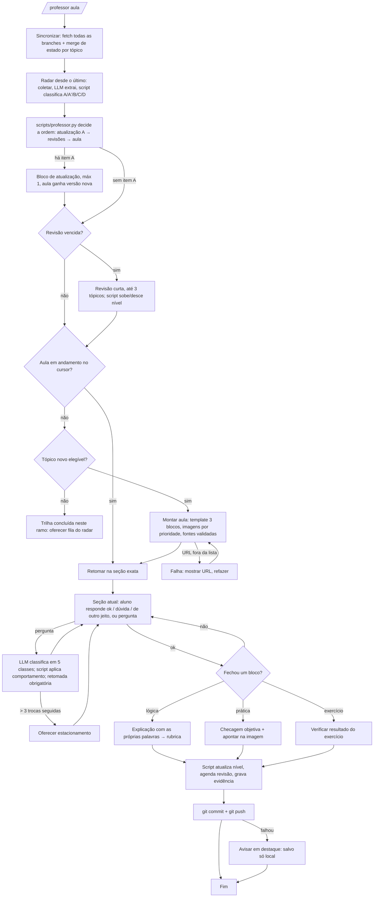

# Spec — Professor IA (tutor pessoal de IA, visual e interativo)

> **Status: v2, RASCUNHO PARA APROVAÇÃO.** Nenhum código é escrito antes de o dono do
> projeto aprovar este desenho (regra 2 da metodologia). Diálogos de exemplo, diagrama e
> staging abaixo. Edge cases estão como ramos explícitos no diagrama.
>
> Data: 30/09/2026 · Fase: pessoal (1 aluno). A fase comercial está na seção 12, só como
> direção, sem compromisso de desenho.
>
> **O que mudou da v1 para a v2** (decisões do dono na descoberta de 30/09):
> escala de conhecimento 1 a 10 por evidência, sem metas de tempo; lógica antes da prática
> em toda aula; imagens reais de apps e páginas; mecanismo do "fio" para perguntar sem
> perder a aula; quatro sinais de entendimento; regras do radar (cadência, quando uma
> novidade entra na aula, prioridade de atualização); risco do celular tratado como teste
> de aceite; aula sempre como arquivo HTML.

---

## 1. A dor (nas palavras do dono)

- "Aprender sobre IA e seus avanços."
- "Professor eficiente que ensine usando recursos visuais e exemplos."
- "Seguir uma matéria só lendo é cansativo; preciso de visual, mas também de poder fazer
  perguntas à medida que vou aprendendo."
- "O mais difícil é fazer perguntas sobre o que estou aprendendo sem que a IA perca a
  essência do que estou aprendendo."
- "Exercícios práticos são fundamentais, mas é muito importante que eu entenda bem a
  lógica por trás."
- "Mostre sempre imagens de como são os apps, páginas, ícones, formatação."

Restrições declaradas:

- Estudo acontece **dentro do Claude Code** (PC ou celular via Claude Code web).
- Progresso **salvo na nuvem**; estudar preso a um único aparelho quebra o hábito.
- Fontes em inglês servem, quanto mais atuais melhor, mas **só fontes legítimas**: nada de
  especulação, rumor ou "ideia não oficial".
- Tudo transmitido **em português**, com o termo em inglês seguido da tradução entre
  parênteses. Ex.: "isso serve pra fazer uma *Home Page* (Página Principal)".
- Nível atual **desconhecido**: precisa de diagnóstico antes de começar.
- **Sem metas de tempo.** O que se mede é conhecimento, numa escala de 1 a 10. Quanto mais
  estuda, mais sobe.

## 2. A dor real (o que vamos endereçar, não o pedido literal)

O pedido literal é "um curso com visual". A dor real é **não ter um professor que se lembre
de onde você está e que não se perca quando você pergunta**. A solução é um sistema que:

1. **Lembra** o que você domina, em que nível, e quando revisar (estado persistente).
2. **Explica a lógica** de cada tópico com visual, depois mostra **como aparece na prática**
   com imagens reais, e fecha com **exercício** no seu próprio stack.
3. **Aceita pergunta no meio da aula** sem perder o fio, porque a aula mora num arquivo com
   cursor, não na memória da conversa.
4. **Acompanha os avanços de IA** a partir de fontes oficiais e os encaixa na trilha por
   regra, priorizando o que muda algo que você já aprendeu.

## 3. O que já existe e o que NÃO vamos reconstruir (regra 1)

| Peça | Já resolvido por | Nossa decisão |
|---|---|---|
| Aula visual gerada a partir de fontes | NotebookLM (vídeo, mapa mental, flashcards) | Não reconstruir. Nossa aula visual nasce **do estado do aluno** e fica versionada por tópico, o que o NotebookLM não faz. |
| Tutor socrático | Claude Learning Mode, Gemini Guided Learning, ChatGPT Study Mode | Reaproveitar o estilo. O diferencial é o estado persistente e o mecanismo do fio. |
| Revisão espaçada | Anki + FSRS (algoritmo aberto) | Implementar versão mínima e determinística em script, com testes. Trocar por FSRS se a fase comercial vier. |
| Busca de avanços | Motores de busca, feeds oficiais | Busca com **lista branca de domínios oficiais** (seção 8). |
| Captura de tela de páginas | Navegador automatizado (Playwright/Chromium, já disponível no ambiente) | Usar para imagens reais de páginas públicas oficiais. |

## 4. Princípios de desenho (herdados da metodologia)

- **LLM não decide lógica de negócio (regra 7).** O LLM explica, desenha, redige, traduz,
  **classifica** (a pergunta é sobre o quê; a novidade muda o quê) e **avalia uma evidência
  isolada** contra uma rubrica. **Quem decide** o que ensinar agora, em que nível você está,
  o que fazer com uma pergunta, o que entra do radar e quando revisar é **código lendo
  arquivos de estado e aplicando regras fixas**.
- **Estado é arquivo versionado em Git.** O repositório no GitHub é a nuvem. Sessão começa
  com sincronização, termina com commit e push (regra 3).
- **A aula mora em arquivo, não na conversa.** Estrutura, fio, seções, rubricas e cursor
  ficam em disco. O histórico do chat pode ser perdido sem perder a aula.
- **Fonte legítima é regra mecânica.** Lista branca em arquivo; validador rejeita URL fora
  dela; especulação e imprensa ficam de fora mesmo citando fonte oficial.
- **Português com termo original.** `*termo em inglês* (tradução)` na primeira ocorrência
  em cada aula. `glossario.md` acumula.
- **Conhecimento, não tempo.** Nenhuma meta de minutos ou sessões por semana. Nível sobe
  por evidência gravada; nunca cai por inatividade.

## 5. Escala de conhecimento: 1 a 10 por tópico, por evidência

| Nível | O que prova | Evidência que o script exige no estado |
|---|---|---|
| 1 | Nunca visto | nenhuma |
| 2 | Viu | todas as seções da aula fechadas com "ok" |
| 3 | Reconhece | checagem objetiva ≥ 2/3 |
| 4 | Reconhece com segurança | checagem objetiva 3/3 **e** identifica o elemento na imagem |
| 5 | Entende a lógica | explicação com as próprias palavras cobre ≥ 60% da rubrica |
| 6 | Entende bem a lógica | explicação cobre 100% da rubrica **e** perguntas na sessão < 3 |
| 7 | Aplica | exercício prático entregue e verificado pelo resultado |
| 8 | Aplica com autonomia | segundo exercício, sem dica, verificado |
| 9 | Domina | resolve caso novo que combina 2+ tópicos |
| 10 | Sustenta | nível 9 **e** 3 revisões espaçadas seguidas sem falha |

Regras fixas (script, com testes):

- Sobe só um nível por sessão por tópico, mesmo que a evidência permita mais. Evita
  "subiu 4 níveis numa tarde" sem sedimentar.
- **Revisão espaçada falhada derruba 1 nível** naquele tópico. Sem isso a escala mede o
  que você já viu, não o que você sabe. Nunca cai por inatividade.
- **3 ou mais perguntas no mesmo tópico na sessão seguram a subida** naquela sessão, mesmo
  com checagem perfeita. A pergunta revela dúvida que a checagem não pegou.
- **Nível geral** = média dos níveis dos tópicos da trilha, tópico não visto valendo 1.
  Mostrado também por módulo. Quanto mais estuda, mais sobe.
- **Diagnóstico** posiciona no máximo até o nível 6 (não há evidência prática). Sem
  resposta = 1; reconhece = 3; explica a lógica = 5.
- Intervalo de revisão: começa em 2 dias, dobra a cada acerto, volta a 2 dias no erro.

## 6. Anatomia de uma aula (formato fixo, em arquivo)

Toda aula tem **três blocos, nesta ordem, sem exceção**. O template é código; o LLM
preenche, não reorganiza.

1. **A lógica.** O mecanismo por dentro: por que funciona, com visual do funcionamento
   (diagrama animado, simulação, comparação). Termina com "me explica com suas palavras",
   corrigido contra a rubrica do arquivo. Aqui se ganham os níveis 5 e 6.
2. **Na prática.** Como isso aparece nos apps, páginas, ícones e formatação: onde clica,
   o que cada campo significa, como se lê a tela. Com imagens reais (seção 6.2). Termina
   com checagem objetiva e "aponte na imagem". Níveis 3 e 4.
3. **Exercício.** Tarefa no seu próprio stack (n8n, Supabase, Claude Code), com critério de
   verificação pelo resultado, não pela descrição. Níveis 7 e 8.

Cada bloco tem seções numeradas. Uma seção só fecha quando você responde no chat:
`ok`, `dúvida` ou `de outro jeito` ("de outro jeito" gera nova explicação com outra
analogia e conta como sinal de dificuldade).

### 6.1 Uma pasta por tópico (arquivos visuais por assunto)

```
aulas/m3_tokens/
├── aula.json        # fio, blocos, seções, objetivos, rubricas, checagens, versão
├── aula.html        # a página visual (abre em qualquer navegador; Artifact quando houver)
├── img/             # capturas reais e reconstruções rotuladas
├── exercicio.md     # tarefa + critério de verificação
└── CHANGELOG.md     # "v2 (12/10): mudou X por causa da fonte Y" (alimentado pelo radar)
```

A aula é criada uma vez e ganha versão nova quando o radar trouxer mudança. Não é
regenerada a cada sessão. Isso dá consistência, custo previsível e histórico auditável.

### 6.2 Regra de imagens

Prioridade, aplicada pelo script ao montar a aula:

1. **Captura real** de página pública oficial (docs da Anthropic, painel do n8n em
   instância de teste, Hugging Face), feita por navegador automatizado, salva em `img/`
   com a URL e a data.
2. **Imagem publicada pela própria documentação oficial** (domínio na lista branca).
3. **Reconstrução em HTML fiel** à interface, sempre com o rótulo visível
   "reconstrução, não captura real".

Áreas logadas (console com sua conta, seu n8n de produção) não são capturadas pelo
sistema: o dono captura, e vale a regra 9. **Nenhuma imagem entra no repositório com
chave, token, cookie ou dado de cliente visível.** O script bloqueia commit de imagem cujo
nome ou pasta não esteja no padrão da aula, e a revisão da captura é do dono.

### 6.3 `aula.json` (esquema resumido)

```json
{
  "topico": "m3.tokens",
  "versao": 1,
  "fio": "Você paga e perde memória por token, não por palavra; entender isso explica custo e esquecimento.",
  "blocos": [
    {"id": "logica", "secoes": [
      {"id": "L1", "objetivo": "o que é um token", "visual": "tokenizador ao vivo"},
      {"id": "L2", "objetivo": "por que português custa mais", "visual": "comparação lado a lado"}
    ], "rubrica": ["token é unidade do modelo, não palavra", "vocabulário vem do treino", "custo e contexto contam em tokens"]},
    {"id": "pratica", "secoes": [
      {"id": "P1", "objetivo": "onde ver a contagem no console", "img": "img/console_usage.png"}
    ], "checagem": [{"q": "...", "opcoes": ["..."], "certa": 2}]},
    {"id": "exercicio", "arquivo": "exercicio.md"}
  ],
  "fontes": ["https://docs.claude.com/..."]
}
```

## 7. O fio: perguntar sem perder a aula

Este é o mecanismo central do projeto. O problema real é que numa conversa longa a aula
existe só na memória do chat, e cada pergunta dilui a essência. A solução não é o LLM
"se esforçar mais". É a aula não depender da memória do LLM.

### 7.1 Cursor em arquivo

`estado/sessao_atual.json` guarda: tópico, bloco, seção atual, seções fechadas, perguntas
feitas nesta sessão (com classe), itens no estacionamento, trocas seguidas fora do fio.
Todo turno do professor começa relendo `aula.json` + cursor. Se a sessão cair ou você
trocar de aparelho, o próximo turno retoma exatamente da seção onde parou.

### 7.2 Toda pergunta passa por classificação antes da resposta

O LLM **classifica** (permitido pela regra 7) em uma de cinco classes. O **script** decide o
comportamento de cada classe. O LLM não escolhe "quanto desviar".

| Classe | Comportamento fixo |
|---|---|
| Sobre a seção atual | Responde completo, com fonte. |
| Sobre seção anterior desta aula | Responde curto e aponta a seção ("isso está em L1, releia o visual"). |
| Sobre seção futura desta aula | Uma frase só, e marca "aparece em P2". Não ensina adiantado. |
| Sobre outro tópico da trilha | Duas frases e vai pro estacionamento com o tópico mapeado. |
| Fora da trilha | Registra em `duvidas.md` como `fora_trilha`, responde curto, sugere onde entraria. |

Toda pergunta incrementa `perguntas_feitas` do tópico (sinal de dificuldade, seção 5).

### 7.3 Retomada obrigatória

Depois de **qualquer** resposta a pergunta, o professor emite a linha de retomada. É
template, não escolha do modelo:

> Voltando. Estávamos em **L2: por que português custa mais**. Faltam L2 e L3 pra fechar a lógica.

### 7.4 Estacionamento

Se uma tangente passar de **3 trocas seguidas** (contadas pelo script), o professor
pergunta: "Isso virou assunto próprio. Registro como mini-aula futura e voltamos?". O
item vai pra `estado/estacionamento.md` com o tópico da trilha onde encaixa, e o script o
oferece quando aquele tópico chegar.

## 8. Radar de avanços: cadência e regras de entrada

### 8.1 Cadência

- **Coleta a cada início de sessão**, cobrindo "desde a data do último radar". Nada se
  perde entre sessões, e não se gasta nada enquanto você não estuda.
- **Rotina semanal** independente da sessão (a mesma rotina que vigia o silêncio, seção
  10): coleta, grava em `radar/entrada/`, e alerta se houver item da classe A (abaixo).
- **Não diário por padrão.** As fontes da lista branca publicam poucas coisas relevantes
  por semana; rodar todo dia gastaria uso sem trazer nada na maioria dos dias. Trocar para
  diário é mudar uma linha da rotina, se um dia o dono quiser.
- **Preço da legitimidade, dito de frente:** você vai saber das coisas alguns dias depois
  de quem lê rumor em rede social. Só entra quando a fonte oficial publicar.

### 8.2 O que acontece com cada novidade (decisão de código)

O LLM **extrai** de cada item: tópico da trilha afetado, se é **mudança de algo existente**
ou **assunto novo**, e se muda **a lógica** ou **a prática** (interface, preço, nome). O
script cruza com o seu nível naquele tópico e aplica:

| Classe | Condição | O que o sistema faz |
|---|---|---|
| **A. Muda o que você já aprendeu** | tópico com nível ≥ 3 | Entra **no início da próxima sessão**, antes de revisão e aula nova, como bloco de atualização de até 10 min. A aula ganha versão nova com `CHANGELOG`. Uma pergunta de revisão sobre o fato novo é agendada. **Prioridade máxima**: conhecimento velho aplicado é pior que nenhum. |
| **A'. Muda só a prática** (tela, preço, nome) | tópico com nível ≥ 3 | Não vira bloco. Captura nova em `img/`, uma linha no `CHANGELOG`, uma linha no digest. |
| **B. Assunto novo com base pronta** | pré-requisitos com nível ≥ 5 | Entra **na fila do módulo**; é ensinado quando a trilha chegar lá. No digest aparece uma linha "na fila de M6". Não é ensinado na hora: novidade sem base é notícia, e notícia sem contexto é o que cansa. |
| **C. Assunto novo sem base** | pré-requisitos < 5 | Só registro em `radar/AAAA-MM-DD.md` com "vai aparecer em M8". Zero ensino. |
| **D. Mudança de paradigma** | item marcado como grande (novo tipo de modelo, novo protocolo, capacidade nova) | Independente de nível, um parágrafo leigo no digest: "o que é e por que importa", rotulado **contexto, não aula**. Não altera nível. Atende a dor 1 sem furar a trilha. |

Limites fixos: no máximo **1 bloco de atualização por sessão** (o resto espera); tópico
que receber atualização tem a revisão espaçada reagendada para 2 dias.

### 8.3 Lista branca inicial (editável por commit)

Primárias e oficiais apenas. Notícia, opinião, rede social e vídeo de comentário ficam de
fora por regra. O validador compara **domínio e prefixo de caminho** quando indicado.

- Anthropic: `anthropic.com`, `docs.claude.com`
- OpenAI: `openai.com`
- Google: `deepmind.google`, `ai.google.dev`, `blog.google/technology/ai/`
- Meta: `ai.meta.com`
- Mistral: `mistral.ai`
- Artigos: `arxiv.org` (rotular "pré-publicação, não revisado por pares")
- Hugging Face: `huggingface.co/blog/`, `huggingface.co/docs/`, cartões de modelo oficiais
- Ferramentas: `pytorch.org`, `docs.n8n.io`, `supabase.com/docs`
- Ensino: `deeplearning.ai`, domínios `.edu`

Critério pra incluir: ser o autor da coisa. Critério pra recusar: ser alguém falando sobre
a coisa.

## 9. Os quatro sinais de entendimento (como o sistema sabe o que você leu ou entendeu)

A IA não vê seus olhos. O desenho separa quatro coisas que costumam ser confundidas:

| Sinal | O que mede | Como é capturado | Alimenta |
|---|---|---|---|
| **Leu** | passou pela seção | `ok` / `dúvida` / `de outro jeito` no chat, seção a seção | nível 2 |
| **Entendeu a lógica** | consegue explicar o mecanismo | explicação com suas palavras corrigida contra a rubrica do `aula.json` | níveis 5 e 6 |
| **Aprendeu** | ainda sabe dias depois | revisão espaçada | sobe/desce 1 nível; nível 10 |
| **Sabe usar** | aplica em caso real | exercício verificado pelo resultado | níveis 7 a 9 |

Sinais auxiliares: perguntas por tópico (seção 5) e "de outro jeito" (marca a seção como
difícil; a próxima versão da aula ganha analogia alternativa nela).

Sinal **desligado por padrão**, decisão do dono: seção longa fechada em poucos segundos
dispara uma checagem extra. Não vira nota, só pergunta.

## 10. Diálogos de exemplo

### 10.1 Primeira sessão: diagnóstico

```
Você:      /professor diagnostico

Professor: Antes de ensinar, preciso saber onde você está. São 18 perguntas, 3 por área.
           Não tem nota: o objetivo é eu não te ensinar o que você já sabe e não pular
           o que você precisa. "Não sei" é resposta válida e útil.

           Área 1 de 6: Fundamentos.
           1) Em uma frase: qual a diferença entre *Machine Learning* (Aprendizado de
              Máquina) e programação tradicional?

Você:      No ML o programa aprende com exemplos em vez de eu escrever a regra.

Professor: Certo, e você explicou a lógica, não só reconheceu. (...)
           [ao fim das 18]
           Nivelamento salvo em estado/progresso.json:

           Fundamentos ........... 5
           LLMs na prática ....... 3
           Prompting ............. 5
           Embeddings e RAG ...... 2
           Agentes e ferramentas . 3
           Treinamento/ajuste .... 1
           Nível geral ........... 3,2

           Recomendação: começar por M3 (LLM na prática). Fundamentos e prompting entram
           só em revisão. Aprovar esse ponto de partida?
```

### 10.2 Sessão normal: atualização do radar, revisão, aula com pergunta no meio

```
Você:      /professor aula

Professor: [sincronizei o estado; radar desde 23/09: 1 item classe A; 1 revisão vencida]

           Antes de tudo, uma atualização de 5 min em algo que você já sabe:
           a Anthropic mudou a documentação de *prompt caching* (cache de prompt), que
           você viu em M3 (nível 5). O que mudou: (...). Fonte: (link oficial).
           A aula m3_tokens virou v2 (CHANGELOG atualizado). Uma pergunta sobre isso
           entra na sua revisão de 02/10.

           Revisão de 2 min: *attention* (atenção), nível 6.
           Sem olhar nada: por que "banco" é entendido diferente em "banco de praça" e
           "banco do Brasil"?

Você:      Porque ele olha as outras palavras da frase e dá peso maior pras que importam.

Professor: Exato. Revisão fechada. Próxima em 8 dias.

           Aula de hoje: M3 · *tokens* e *context window* (janela de contexto).
           Fio da aula: você paga e perde memória por token, não por palavra.
           Abri a aula visual (aulas/m3_tokens/aula.html, link do Artifact no celular).

           Bloco 1, A lógica · L1: o que é um token.
           No visual, digite uma frase no tokenizador e veja como ela é fatiada.
           Quando terminar: ok, dúvida, ou de outro jeito.

Você:      Pera, então o custo é por token e não por palavra? Em português sai mais caro?

Professor: [classe: seção futura L2 → uma frase, sem adiantar]
           Sim, e é exatamente a próxima seção. Guardo pra L2.
           Voltando. Estávamos em **L1: o que é um token**. Falta você fechar L1.

Você:      ok

Professor: L1 fechada. L2: por que português custa mais. (...) [responde a pergunta aqui]
           (...)
           Fim do bloco da lógica. Me explica com suas palavras: por que um agente no
           n8n "esquece" o começo de conversas longas?

Você:      Porque a conversa vira tokens e a janela tem limite; quando estoura, o modelo
           só vê os últimos.

Professor: Rubrica: 3 de 3 pontos cobertos. Você tinha 2 perguntas no tópico, abaixo do
           limite. m3.tokens: nível 3 → 4 hoje (sobe 1 por sessão; a explicação já garante
           o próximo degrau na próxima sessão com revisão).

           Bloco 2, Na prática · P1: onde a contagem aparece no console.
           [imagem real da página de uso, capturada em 28/09]
           Aponte: qual dos três números é o que cobra?
           (...)
           Salvo e enviado pro GitHub (commit "sessao 2026-09-30: m3.tokens 3→4").
```

### 10.3 Radar semanal

```
Professor: Radar 23/09 a 30/09, só fontes da lista branca. 3 itens relevantes; 5
           descartados (fora da lista ou opinião).

           A · Anthropic: doc nova de *prompt caching*. Muda M3 (nível 5). Entra no início
               da próxima sessão. Fonte: (link).
           B · Hugging Face: modelo aberto de *embeddings* multilíngues. Vai pra fila de M5
               (você está em 2; precisa de 5 em M2 pra entrar).
           D · Contexto, não aula: OpenAI publicou (…). Em uma frase, por que importa: (…).

           Salvo em radar/2026-09-30.md.
```

### 10.4 Edge cases que viram ramo explícito

- **Sem rede ou push falhou:** a sessão continua; ao final, aviso em destaque "progresso
  salvo só local, não subiu", e nova tentativa no início da próxima sessão.
- **Estado em branch não mesclada (celular):** ao iniciar, a skill busca todas as branches
  remotas e mescla progresso pendente **por tópico, registro mais recente vence**, mostrando
  o que juntou. Nunca descarta em silêncio. Esse cenário é **teste de aceite da onda 1**:
  se Git não sustentar o celular, o estado vai para Supabase ainda na fase pessoal.
- **Fonte fora da lista branca citada:** comando falha mostrando a URL; o LLM refaz sem a
  fonte ou o dono inclui a fonte por commit.
- **Sessão interrompida no meio da aula:** cursor salvo; próxima sessão (qualquer aparelho)
  retoma na seção exata, com a linha de retomada.
- **Muito tempo sem estudar (> 14 dias):** nenhum nível cai; o script propõe sessão só de
  revisão antes de tópico novo.
- **Modo curto (celular, 10 min):** `/professor curto` faz só revisões vencidas ou fecha
  uma única seção pendente. Sem aula nova.

## 11. Diagrama do fluxo de uma sessão



## 12. Métricas (conhecimento, não tempo)

Todas saem de `estado/progresso.json`. Nenhuma tem prazo.

- **Nível geral** (1 a 10) e **nível por módulo**.
- **Taxa de retenção**: acertos em revisão vencida / total de revisões.
- **Exercícios verificados** (contagem por módulo).
- **Cobertura da trilha**: tópicos com nível ≥ 5 / total.
- **Atualizações absorvidas**: itens classe A que viraram revisão acertada.

Marcos de leitura (não metas): nível geral 5 = base sólida para conversar de igual com
quem constrói; 7 = constrói sozinho no seu stack; 9 = ensina outros.

## 13. Staging: desenho do ensaio isolado

**Blast radius:** baixo. Sem usuário externo. O que pode quebrar: o arquivo de progresso
real (histórico de estudo), a confiança na regra de fontes, e uma imagem com dado
sensível entrando no repositório.

1. **Perfil de teste.** `--perfil teste` lê e grava em `estado-teste/` e `aulas-teste/`.
   Todo desenvolvimento roda nele. Registros com prefixo `TESTE_`. Fim de sessão de
   desenvolvimento apaga tudo (regra 6).
2. **Regressão do script.** `scripts/test_professor.py` cobre: escolha do próximo tópico
   com pré-requisito; subida limitada a 1 por sessão; descida por revisão falhada;
   bloqueio por 3 perguntas; classificação de pergunta → comportamento; contagem de
   trocas para estacionamento; classes A/A'/B/C/D do radar por nível; merge de branch
   por tópico; validador de fontes com URL boa, ruim, subdomínio falso e prefixo de
   caminho. **3x verde** antes de qualquer alteração ir pro perfil real.
3. **Paridade.** Antes de promover, o teste roda com **cópia do `progresso.json` real**,
   não com JSON magro inventado (lição de 26/08).
4. **Canário.** Primeira sessão real com versão nova é uma revisão curta, com o dono
   olhando o diff do `progresso.json` antes do push.
5. **Reversibilidade.** Git. Commit atômico por sessão, nomeado
   (`sessao AAAA-MM-DD: topico N→M`). Reverter é um `git revert`.
6. **Silêncio também é falha (regra 8).** Rotina semanal fora do repositório: checa a data
   do último commit de sessão e, sem commit em 7 dias, manda lembrete; na mesma passada,
   coleta o radar. O lembrete vive fora do sistema que pode estar parado.
7. **Segurança (regra 9).** Sem segredo em nenhum arquivo. Script recusa commit de imagem
   fora de `aulas/*/img/`; captura de área logada é do dono, com revisão visual antes.

## 14. Plano de Ação em ondas (critério de aceite por onda)

### Onda 1: fundação, diagnóstico, sincronização
- Repositório privado `professor-ia` com a estrutura da seção 6.1 e `estado/`.
- `curriculo/trilha.md` v1 (seção 15) e `banco_diagnostico.json` (18 perguntas com
  gabarito e rubrica).
- `scripts/professor.py`: escala 1 a 10, agenda de revisão, merge de branch, validador
  de fontes. `test_professor.py` 3x verde.
- Skill `professor` com `diagnostico`, `aula` (sem imagens ainda), `curto`.
- **Aceite:** diagnóstico real feito pelo dono; `progresso.json` gerado; uma sessão no PC
  e a seguinte no celular com o estado batendo nos dois. **Se falhar, decisão explícita:
  Supabase na fase pessoal.**

### Onda 2: aula completa e o fio
- Template de 3 blocos; `aula.json` + `aula.html` por tópico; regra de imagens com
  captura real por navegador; rubrica e explicação com as próprias palavras.
- Cursor, classificação de perguntas em 5 classes, retomada obrigatória, estacionamento.
- Glossário automático.
- **Aceite:** 3 aulas reais concluídas; pelo menos 5 perguntas feitas no meio de aulas com
  a retomada funcionando e o dono confirmando que não perdeu o fio; 1 revisão vencida
  cobrada; aula abre e é legível no celular.

### Onda 3: radar, atualização e vigilância
- Coleta por sessão e rotina semanal; classes A/A'/B/C/D; versão de aula com CHANGELOG.
- Lembrete por silêncio.
- **Aceite:** um radar real só com fontes da lista; um item classe A virou bloco de
  atualização e pergunta de revisão; lembrete disparou em teste controlado.

### Onda 4 (futuro, fora deste escopo): comercial
- Estado migra para Supabase (multiusuário, RLS por aluno); interface web ou WhatsApp;
  custo de LLM por aluno medido desde o dia 1.

## 15. Trilha v1 (módulos; tópicos detalhados nascem na onda 1)

| Módulo | Tema | Pré-requisito |
|---|---|---|
| M1 | Fundamentos: IA, *Machine Learning* (Aprendizado de Máquina), *Deep Learning* (Aprendizado Profundo), treino vs inferência | nenhum |
| M2 | Redes neurais e o *Transformer*: *embeddings* (vetores de significado), *attention* (atenção) | M1 |
| M3 | LLM na prática: *tokens*, *context window* (janela de contexto), *temperature*, custo | M2 |
| M4 | *Prompting* e engenharia de contexto: *system prompt*, exemplos, *structured output* (saída estruturada) | M3 |
| M5 | Busca semântica e *RAG* (geração com recuperação) | M2, M4 |
| M6 | Agentes, *tools* (ferramentas), *MCP*, decisão de código vs de modelo | M4 |
| M7 | Avaliação, alucinação, segurança, *guardrails* (trilhos de proteção) | M6 |
| M8 | Como modelos são treinados: pré-treino, *fine-tuning* (ajuste fino), *RLHF* | M3 |
| M9 | Multimodal: imagem, áudio, voz | M3 |
| M10 | Ecossistema e avanços (alimentado pelo radar, sem fim) | M7 |

## 16. Estimativa honesta de esforço

| Onda | Horas |
|---|---|
| 1 | 8 a 12 |
| 2 | 12 a 18 (o fio e as imagens são o grosso) |
| 3 | 5 a 8 |
| Total fase pessoal | 25 a 38 |

Sem custo de API: roda na assinatura do Claude Code. A rotina semanal consome uma sessão
curta por semana.

## 17. Decisões que o dono precisa aprovar

1. Repositório próprio e privado `professor-ia`.
2. Git como nuvem do estado nesta fase, com o teste do celular como critério de aceite da
   onda 1 (falhou → Supabase).
3. Escala 1 a 10 por evidência da seção 5, incluindo: sobe 1 por sessão; revisão falhada
   derruba 1; 3 perguntas seguram a subida.
4. Formato fixo de aula em 3 blocos (lógica → prática → exercício) e regra de imagens.
5. Mecanismo do fio: 5 classes de pergunta com comportamento fixo, retomada obrigatória,
   estacionamento após 3 trocas.
6. Radar: coleta por sessão + rotina semanal (não diário); classes A/A'/B/C/D; máximo 1
   bloco de atualização por sessão; lista branca da seção 8.3.

Aprovado, a onda 1 começa pela criação do repositório e do script com testes, nessa ordem.
